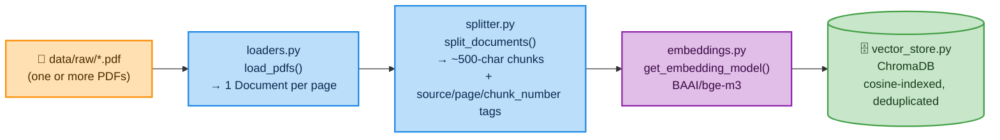
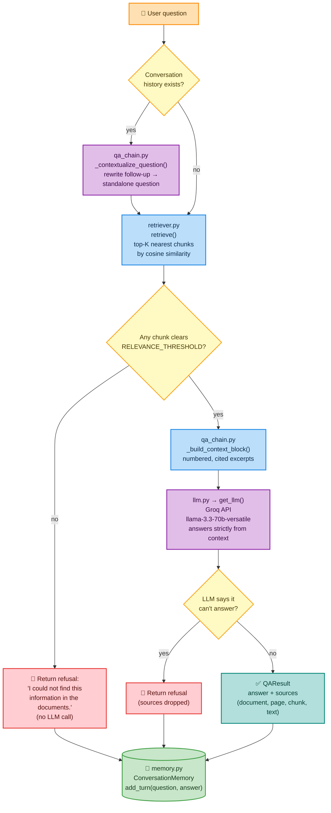
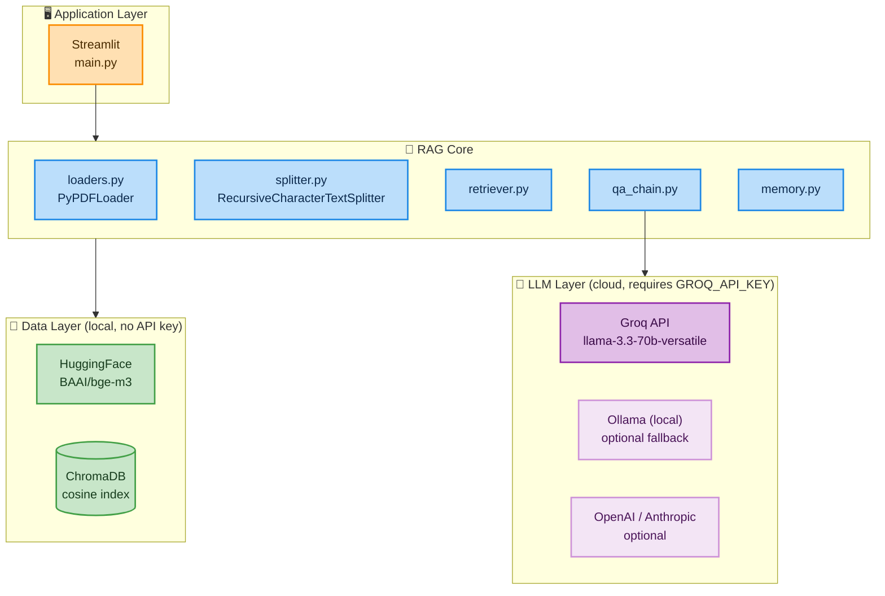
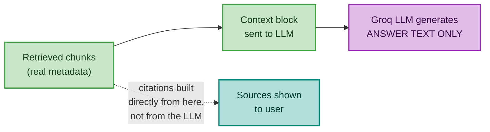
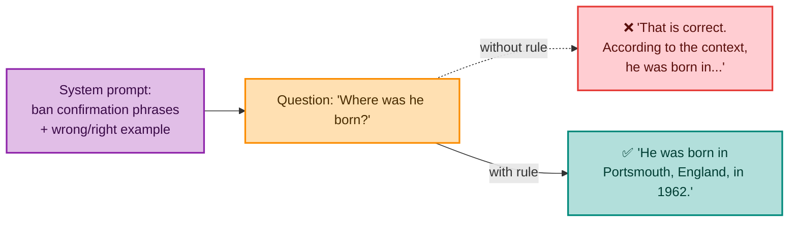
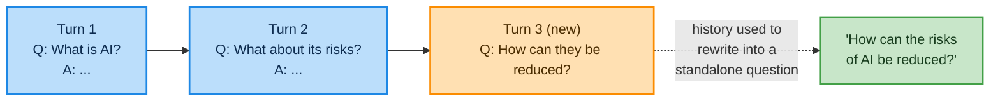
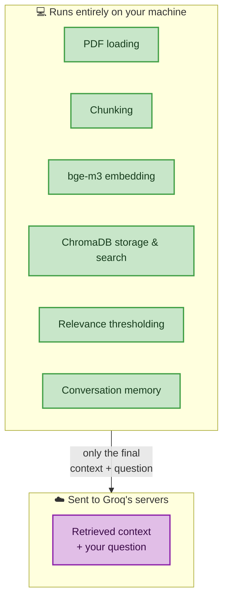

# Architecture

This document describes how data flows through the Document-Based AI
Question Answering System, from raw PDFs on disk to a cited, grounded
answer in the chat UI. Diagrams below use [Mermaid](https://mermaid.js.org/)
— they render automatically on GitHub, GitLab, VS Code (with the Mermaid
extension), Obsidian, and most modern Markdown viewers.

---

## 1. Ingestion Pipeline

Turns raw PDFs into searchable vectors in ChromaDB.

`pipeline.py` runs all four steps above, in order, in a single call —
it's the only module that touches every stage of ingestion. Re-running
it is safe: chunks are deduplicated by a deterministic
`source_page_chunknumber` ID, so nothing gets indexed twice.

`bge-m3` runs locally via `sentence-transformers` — no API key or
network call needed for embedding, only for the LLM step later.

---

## 2. Question-Answering Flow

Turns a user's question into a grounded, cited answer — or an honest
refusal.

The LLM step (`CB → LLM`) is the only network call to Groq in the
entire flow — retrieval, thresholding, and memory are all local.

---

## 3. Technology Stack

`llm.py` is provider-agnostic (LangChain's `init_chat_model`) — Groq
is the active default, but Ollama/OpenAI/Anthropic remain one `.env`
change away with no code changes.

---

## Why Citations Are Never LLM-Generated

The LLM only ever produces the **answer text**. Every `Source` in the
final result — document name, page, chunk number, retrieved text —
comes directly from `RetrievedChunk` objects assembled in
`retriever.py`, **before** the LLM is even called.

This guarantees citations are always real: the LLM has no opportunity
to invent a page number or misquote a source, because it never decides
what the citations are — it only decides what to say using the context
it was given.

---

## Two Independent Refusal Paths

| # | Path | Where it happens | LLM called? |
|---|---|---|---|
| 1 | 🚫 **No relevant chunks retrieved** | `retriever.py` — nothing clears `RELEVANCE_THRESHOLD` | ❌ No — saves an API call, guarantees no hallucinated answer when the corpus doesn't cover the topic |
| 2 | 🚫 **LLM decides context is insufficient** | `qa_chain.py` — `_is_refusal()` detects the LLM's own refusal | ✅ Yes — chunks were retrieved, but didn't actually answer *this specific* question |

In both cases, the user sees the same message:
> *"I could not find this information in the documents."*

---

## Answer Style Enforcement

Beyond grounding and citations, the system prompt also enforces *how*
the LLM opens each answer. Smaller/faster conversational models like
`llama-3.3-70b-versatile` tend to default to confirmatory filler
("That is correct. According to the context, ..."), which reads
awkwardly for a fresh question. The prompt explicitly bans this class
of phrasing and shows a wrong/right example, so the model states facts
directly instead of reacting to them.

---

## Conversation Memory

`ConversationMemory` (`memory.py`) is a simple in-memory, per-session
rolling window of the last `MAX_HISTORY_TURNS` (question, answer)
pairs — no database, no persistence across restarts. In the Streamlit
app, one instance lives in `st.session_state` per browser session.

It's used in exactly one place: `_contextualize_question()` sends the
history plus the new question to the LLM (Groq) and asks it to rewrite
ambiguous follow-ups into standalone questions **before** retrieval
runs. Retrieval and the final answer are otherwise stateless — memory
affects what gets searched for, not what "counts" as relevant.

---

## Local vs. Cloud Boundary

Worth calling out explicitly, since it affects offline behavior and
data privacy: only the LLM step leaves your machine.

Indexing and retrieval work fully offline; only asking a question
requires internet access and a valid `GROQ_API_KEY`.